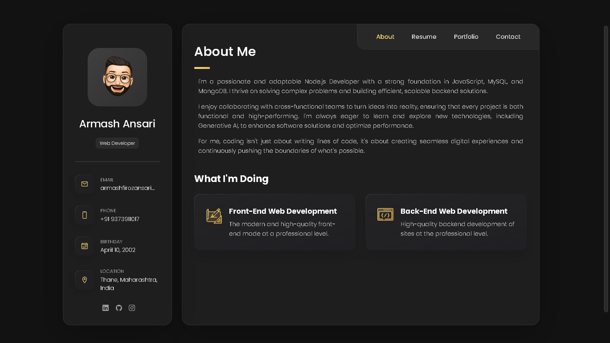

# Portfolio Website

A responsive and interactive personal portfolio website built using **HTML5**, **CSS3**, and **vanilla JavaScript**. This project showcases my web development skills, projects, and experiences with a clean design, smooth animations, and user-friendly navigation.

## Features

- **Responsive Design**: Optimized for desktops, tablets, and mobile devices.
- **Project Showcase**: Display of various projects with detailed descriptions.
- **Contact Form**: Functional form to get in touch easily.
- **Interactive UI**: Engaging user interface with intuitive navigation.

## Technologies Used

- **HTML5**: Markup language for structuring the website.
- **CSS3**: Styling with modern CSS features and responsive design techniques.
- **Vanilla JavaScript**: Adding interactivity and dynamic behavior.

## Installation

1. **Clone the Repository**

   ```bash
   git clone https://github.com/armansdev/armansdev.github.io.git
   ```

2. **Navigate to the Project Directory**

   ```bash
   cd armansdev.github.io
   ```

3. **Open the `index.html` File in Your Browser**
   You can open the file directly or use a live server extension in your code editor.

## Usage

- Customize the content in `index.html` to reflect your personal information and projects.
- Modify styles in `style.css` to match your design preferences.
- Update scripts in `main.js` if you want to add more interactivity.

## Screenshots



## Contributing

Contributions are welcome! If you have suggestions for improvements, feel free to fork the repository and submit a pull request.

## Contact

For any inquiries or feedback, feel free to reach out:

- **Email**: armashfirozansari@gmail.com
- **LinkedIn**: https://www.linkedin.com/in/armash-ansari-3b4811222
- **GitHub**: https://github.com/armansdev

---

Thank you for checking out my portfolio! 😊
